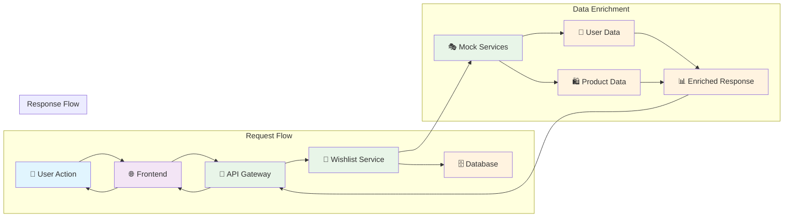
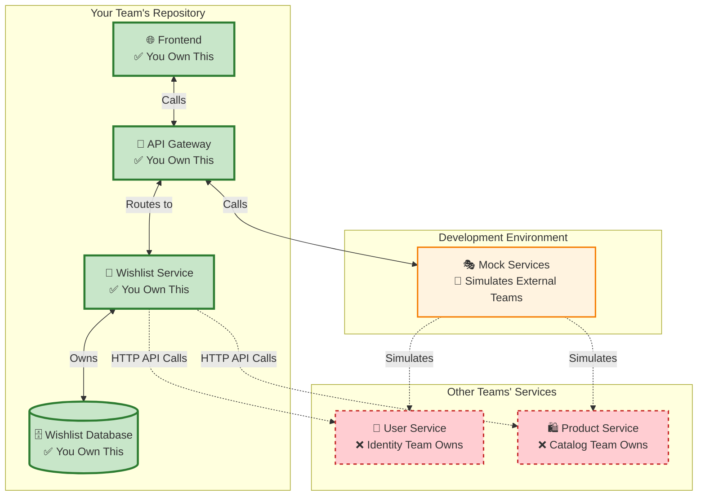
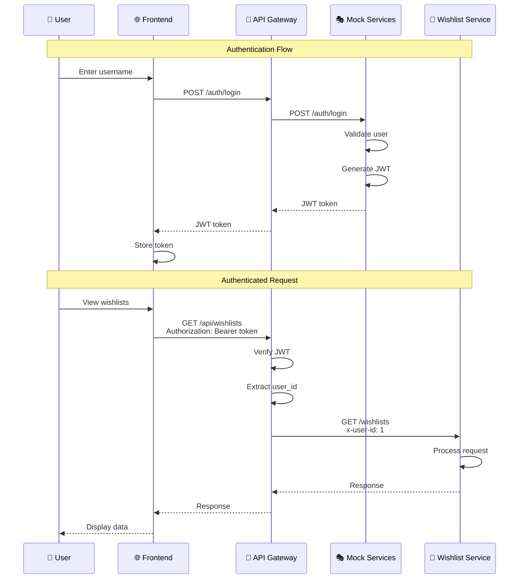
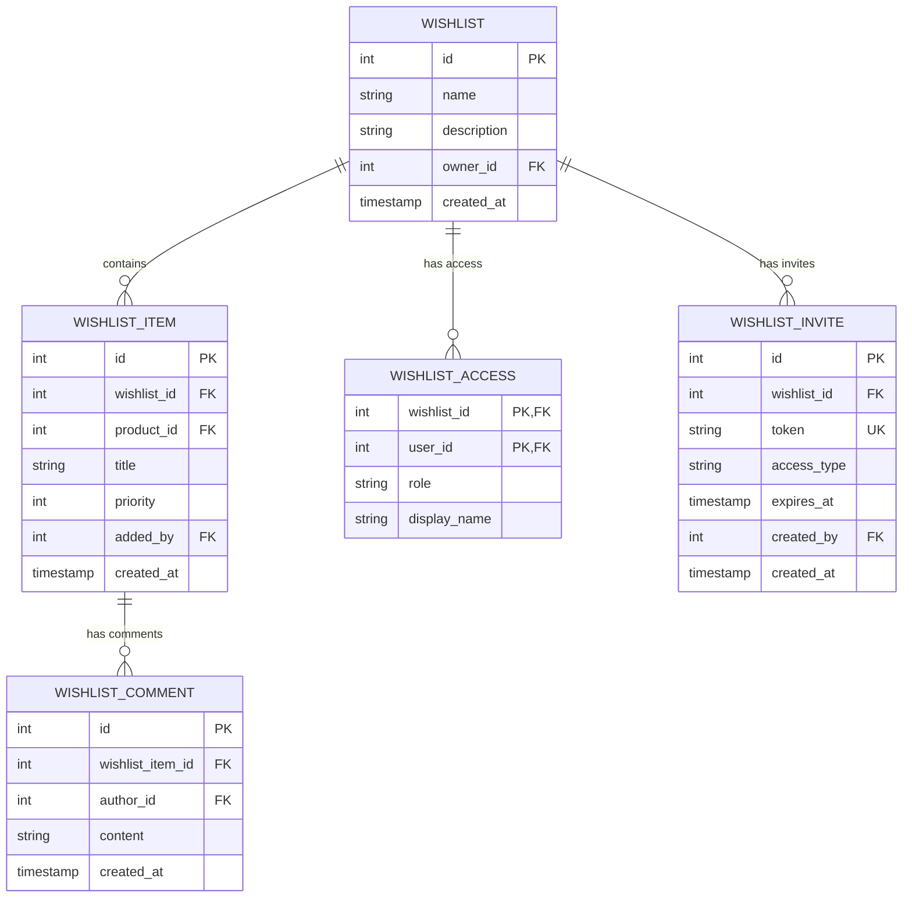
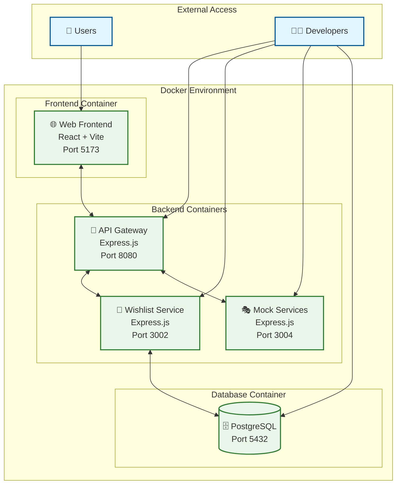
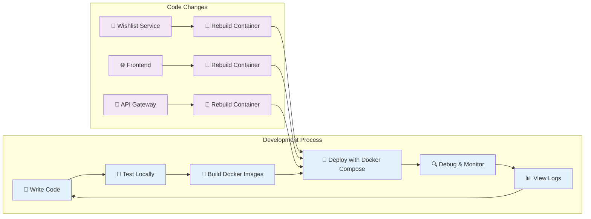

# Architecture Diagrams - Amazon Collaborative Wishlist

This document provides visual architecture diagrams for the Amazon Collaborative Wishlist system, showing the complete system design and component relationships.

## 🏗️ High-Level System Architecture

```mermaid
graph TB
    subgraph "Client Layer"
        FE[🌐 Web Frontend<br/>React + Vite<br/>Port 5173<br/>Amazon-style UI]
    end
    
    subgraph "API Gateway Layer"
        AG[🚪 API Gateway<br/>Express.js<br/>Port 8080<br/>Authentication & Routing]
    end
    
    subgraph "Service Layer"
        WS[📝 Wishlist Service<br/>Express.js<br/>Port 3002<br/>Your Team's Code]
        MS[🎭 Mock Services<br/>Express.js<br/>Port 3004<br/>Simulates External Teams]
    end
    
    subgraph "Data Layer"
        DB[(🗄️ PostgreSQL<br/>Port 5432<br/>wishlistdb<br/>Your Database)]
    end
    
    subgraph "External Services (Simulated)"
        US[👤 User Service<br/>Identity Team<br/>Authentication & Profiles]
        PS[🛍️ Product Service<br/>Catalog Team<br/>Products & Search]
    end
    
    %% Main connections
    FE <-->|HTTPS/REST| AG
    AG <-->|HTTP/REST| WS
    AG <-->|HTTP/REST| MS
    WS <-->|SQL| DB
    MS -.->|Simulates| US
    MS -.->|Simulates| PS
    WS -.->|HTTP API Calls| US
    WS -.->|HTTP API Calls| PS
    
    %% Styling
    classDef client fill:#e1f5fe,stroke:#01579b,stroke-width:2px
    classDef api fill:#f3e5f5,stroke:#4a148c,stroke-width:2px
    classDef service fill:#e8f5e8,stroke:#1b5e20,stroke-width:2px
    classDef data fill:#fff3e0,stroke:#e65100,stroke-width:2px
    classDef external fill:#fce4ec,stroke:#880e4f,stroke-width:2px,stroke-dasharray: 5 5
    
    class FE client
    class AG api
    class WS,MS service
    class DB data
    class US,PS external
```



## 🔄 Data Flow Architecture



## 🏢 Service Ownership Model



## 🔐 Security & Authentication Flow



## 🗄️ Database Architecture



## 🔄 Collaboration Flow

```mermaid
graph TD
    subgraph "Invitation Creation"
        A[👤 Owner creates invite] --> B[📝 Generate token]
        B --> C[🗄️ Store in database]
        C --> D[🔗 Create invite link]
    end
    
    subgraph "Invitation Acceptance"
        E[👤 User clicks link] --> F[🔍 Validate token]
        F --> G[✅ Check expiration]
        G --> H[👥 Add to access list]
        H --> I[🎉 Access granted]
    end
    
    subgraph "Collaboration"
        J[👥 View shared wishlist] --> K[📝 Add items (if permitted)]
        K --> L[💬 Comment on items (if permitted)]
    end
    
    D --> E
    I --> J
    
    classDef process fill:#e3f2fd
    classDef database fill:#fff3e0
    classDef user fill:#e1f5fe
    
    class A,E,J user
    class B,D,F,G,H,I,K,L,M process
    class C database
```

## 🚀 Deployment Architecture



## 🔧 Development Workflow



## 🎯 Key Architectural Principles

### 1. Service Ownership
- **Wishlist Service**: Owns all wishlist domain data
- **External Services**: User and product data via API calls
- **Clear Boundaries**: No direct database access to external data

### 2. Data Enrichment
- **Core Data**: From wishlist service database
- **External Data**: Via HTTP API calls to other services
- **Graceful Degradation**: Fallback when external services fail

### 3. Authentication & Authorization
- **JWT Tokens**: Stateless authentication
- **API Gateway**: Centralized token validation
- **Role-Based Access**: Granular permissions for collaboration

### 4. Scalability & Performance
- **Microservices**: Independent scaling
- **Database Isolation**: Service-owned data
- **Caching Opportunities**: External service responses

### 5. Development Experience
- **Mock Services**: Simulate external dependencies
- **Docker Compose**: Easy local development
- **Clear Documentation**: Comprehensive guides

This architecture provides a solid foundation for building collaborative wishlist features while maintaining the real Amazon work environment patterns of service ownership and external API dependencies.
