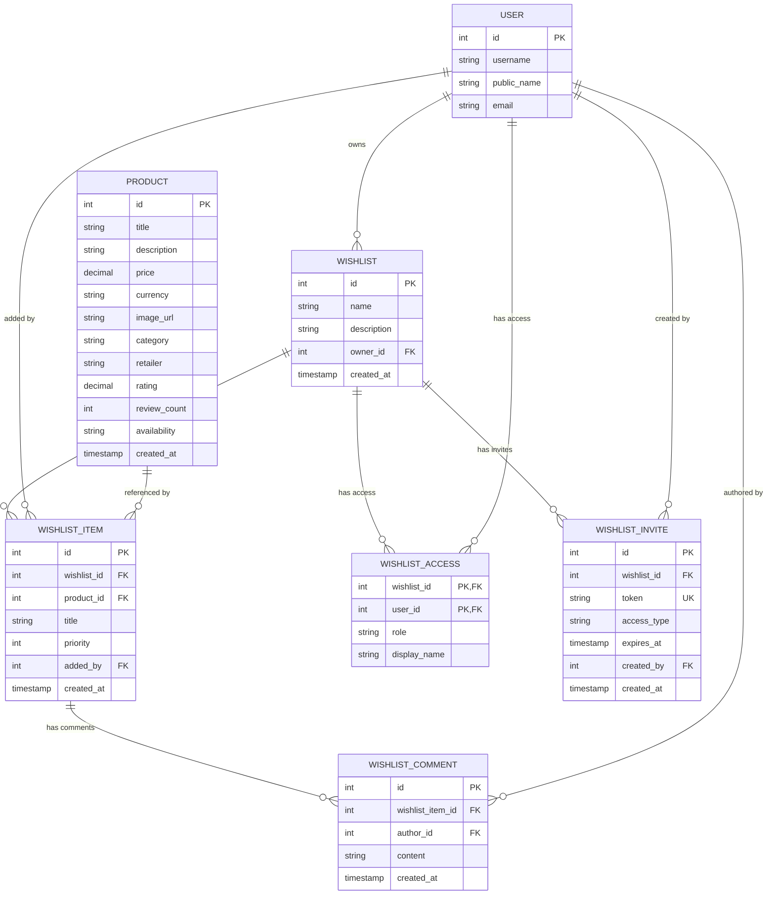

# Database ERD - Amazon Collaborative Wishlist

This document provides Entity Relationship Diagrams (ERD) for the Amazon Collaborative Wishlist system database schema.

## 🗄️ Database Overview

The system uses **PostgreSQL** with the wishlist service owning its own database. The database contains all wishlist-related tables with external references to user and product data from other services.

## 📊 Complete Database ERD



## 📋 Table Descriptions

### Core Tables

#### `wishlist`
- **Purpose**: Stores wishlist containers
- **Owner**: Wishlist service
- **Key Fields**:
  - `id`: Primary key
  - `name`: Wishlist name
  - `description`: Optional description
  - `owner_id`: External user ID (references user service)
  - `created_at`: Creation timestamp

#### `wishlist_item`
- **Purpose**: Stores items within wishlists
- **Owner**: Wishlist service
- **Key Fields**:
  - `id`: Primary key
  - `wishlist_id`: Foreign key to wishlist
  - `product_id`: External product ID (references product service)
  - `title`: Item title (cached from product service)
  - `priority`: Item priority (1-5)
  - `added_by`: External user ID (references user service)
  - `created_at`: Creation timestamp

#### `wishlist_access`
- **Purpose**: Manages user access permissions
- **Owner**: Wishlist service
- **Key Fields**:
  - `wishlist_id`: Foreign key to wishlist (part of composite PK)
  - `user_id`: External user ID (part of composite PK)
  - `role`: Access role (owner, view_only, view_edit, comment_only)
  - `display_name`: Custom display name for the user in this wishlist

#### `wishlist_invite`
- **Purpose**: Manages invitation tokens
- **Owner**: Wishlist service
- **Key Fields**:
  - `id`: Primary key
  - `wishlist_id`: Foreign key to wishlist
  - `token`: Unique invitation token
  - `access_type`: Type of access being granted
  - `expires_at`: Token expiration timestamp
  - `created_by`: External user ID who created the invite
  - `created_at`: Creation timestamp

#### `wishlist_comment`
- **Purpose**: Stores comments on wishlist items
- **Owner**: Wishlist service
- **Key Fields**:
  - `id`: Primary key
  - `wishlist_item_id`: Foreign key to wishlist_item
  - `author_id`: External user ID (references user service)
  - `content`: Comment text
  - `created_at`: Creation timestamp

## 🔗 External Service References

### User Service References
- `wishlist.owner_id` → `user.id`
- `wishlist_item.added_by` → `user.id`
- `wishlist_access.user_id` → `user.id`
- `wishlist_invite.created_by` → `user.id`
- `wishlist_comment.author_id` → `user.id`

### Product Service References
- `wishlist_item.product_id` → `product.id`

## 🎯 Key Design Principles

### 1. Service Ownership
- **Wishlist service owns all wishlist domain data**
- **External references use IDs only**
- **No foreign key constraints to external services**

### 2. Data Enrichment
- **User data fetched via HTTP API calls**
- **Product data fetched via HTTP API calls**
- **Cached titles in wishlist_item for performance**

### 3. Access Control
- **Role-based permissions in wishlist_access**
- **Invitation system with expiration**
- **Composite primary keys for access control**

### 4. Scalability
- **No cross-service foreign keys**
- **External service failures don't break wishlist operations**
- **Cached data for performance**

## 📊 Sample Data Relationships

```sql
-- Example: Alice's Birthday Wishlist
wishlist: {
  id: 1,
  name: "Birthday Wishlist",
  owner_id: 1,  -- Alice (from user service)
  created_at: "2024-01-01T00:00:00Z"
}

-- Items in the wishlist
wishlist_item: [
  {
    id: 1,
    wishlist_id: 1,
    product_id: 1,  -- Sony Headphones (from product service)
    title: "Sony WH-1000XM4 Wireless Noise Canceling Headphones",
    added_by: 1,    -- Alice
    created_at: "2024-01-01T00:00:00Z"
  }
]

-- Access permissions
wishlist_access: [
  {
    wishlist_id: 1,
    user_id: 1,     -- Alice (owner)
    role: "owner"
  },
  {
    wishlist_id: 1,
    user_id: 2,     -- Bob (from user service)
    role: "view_only",
    display_name: "Bob Smith"
  }
]

-- Invitation
wishlist_invite: {
  id: 1,
  wishlist_id: 1,
  token: "DMTTLZ4Gl6E9he_gRG9OsxMjVKyKBGmp",
  access_type: "view_only",
  created_by: 1,    -- Alice
  expires_at: "2024-01-08T00:00:00Z"
}
```

## 🔄 Data Flow with External Services


## 🚀 Future Extensions

### Comments System
The `wishlist_comment` table is ready for implementation:
- Comments are linked to specific items
- Author information via external user service
- Timestamps for ordering

### Advanced Permissions
The `wishlist_access` table supports multiple roles:
- `owner`: Full control
- `view_only`: Read-only access
- `view_edit`: Can add/remove items
- `comment_only`: Can only comment

### Real-time Features
Database is designed to support:
- WebSocket connections for live updates
- Notification triggers for changes
- Audit trails for collaboration

This database design provides a solid foundation for the wishlist service while maintaining clear boundaries with external services.
