# System Flow Diagrams - Amazon Collaborative Wishlist

This document provides comprehensive flow diagrams for the Amazon Collaborative Wishlist system, showing how data flows through the microservices architecture.

## 🏗️ System Architecture Flow

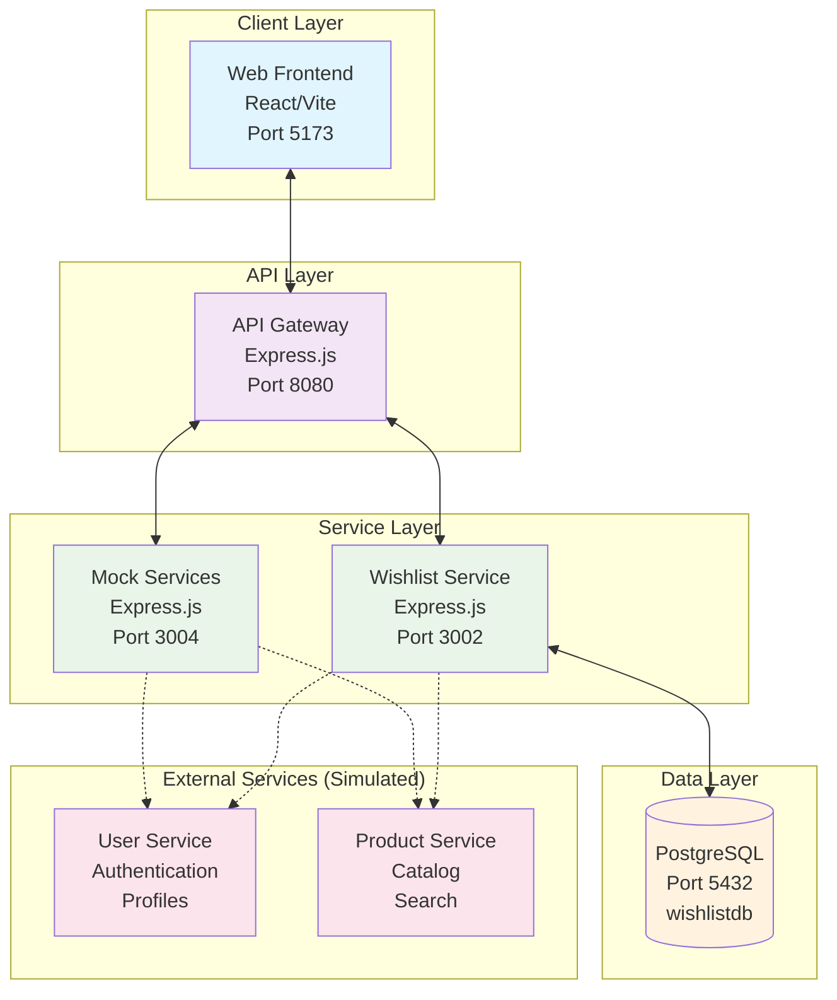

## 🔐 Authentication Flow

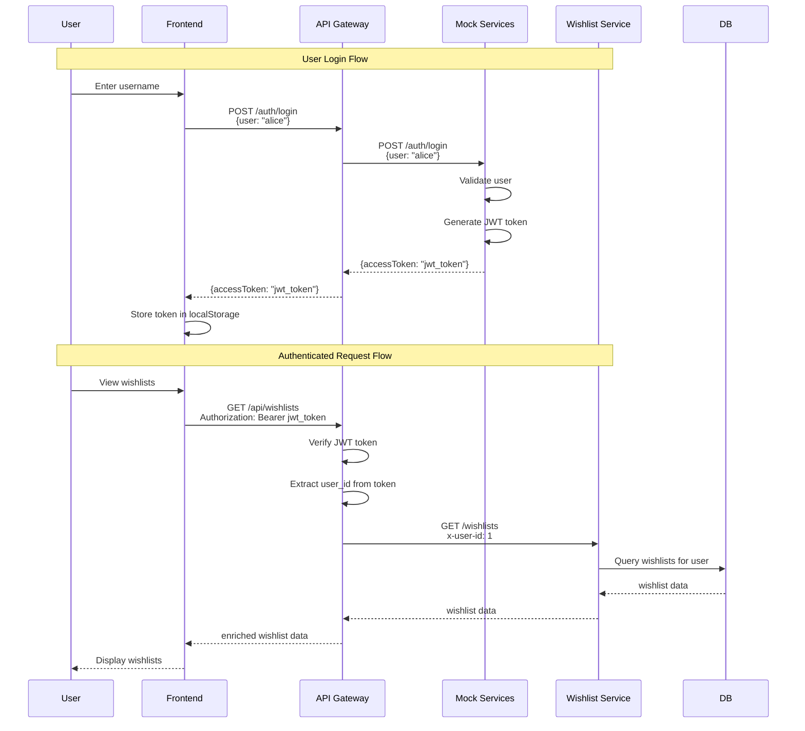

## 📋 Wishlist Operations Flow

### Creating a Wishlist

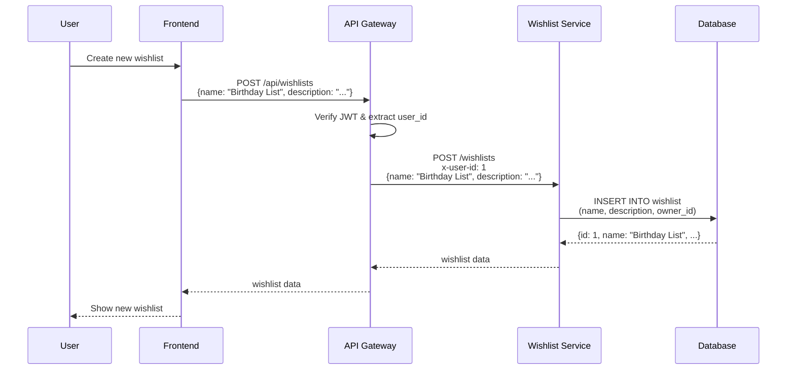

### Adding Items to Wishlist

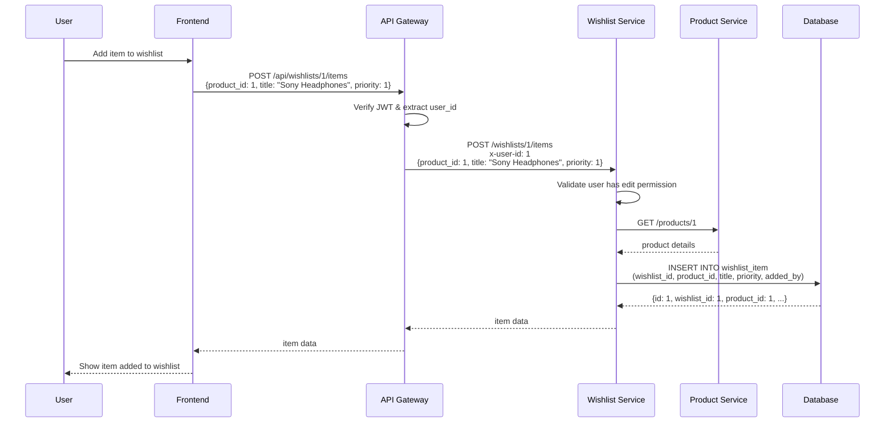

### Viewing Wishlist with Items

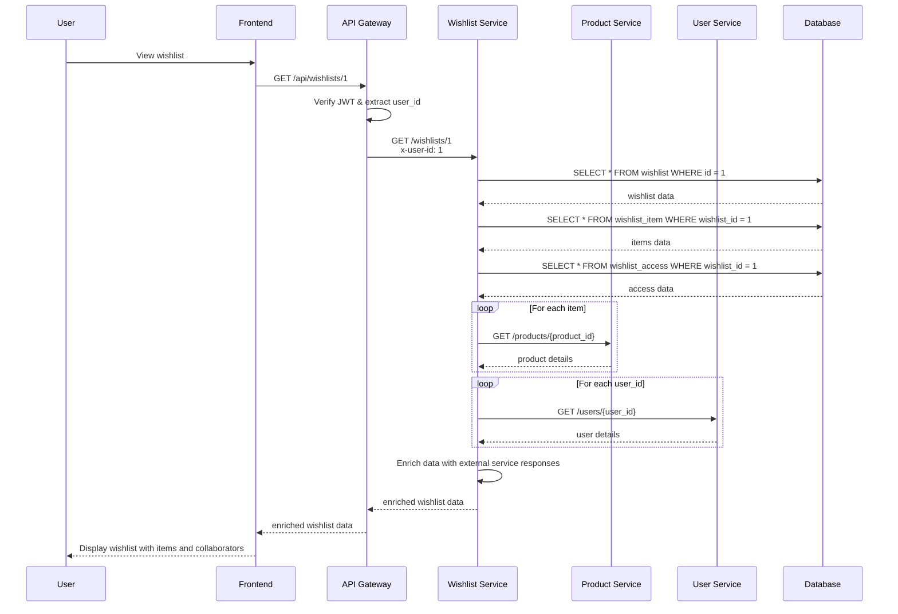

## 🤝 Collaboration Flow

### Creating an Invitation

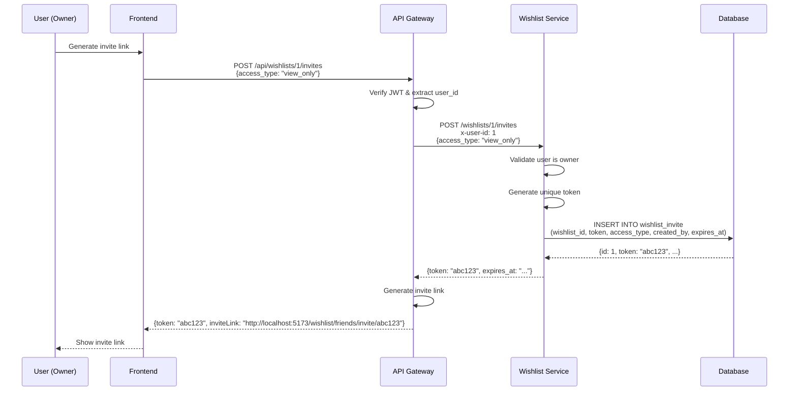

### Accepting an Invitation

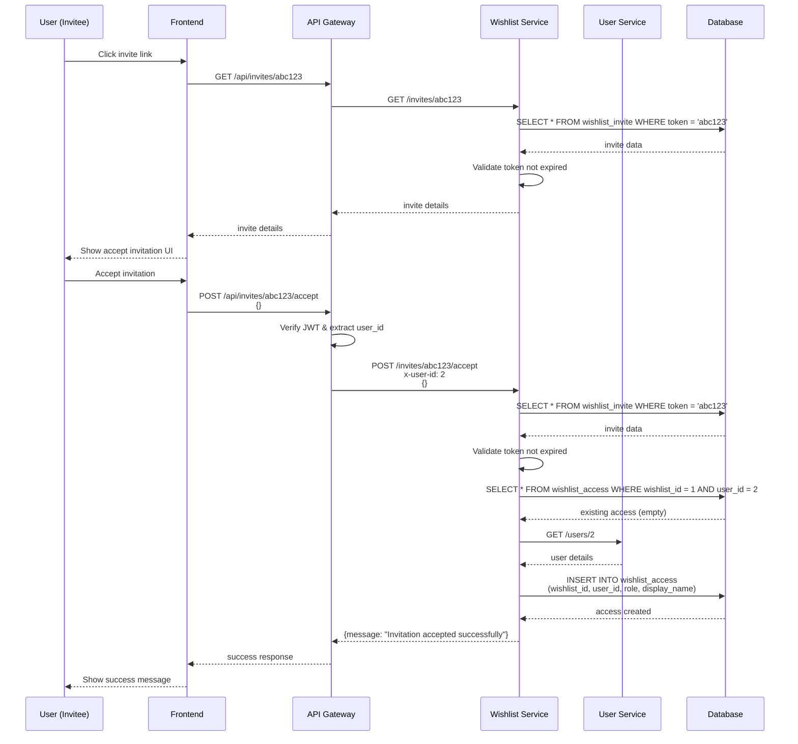

### Managing Collaborators

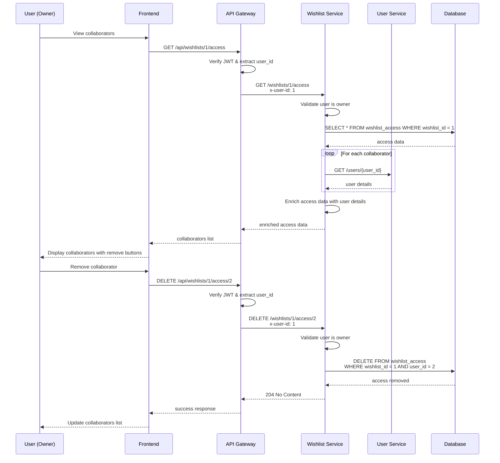

## 🔄 Data Enrichment Flow

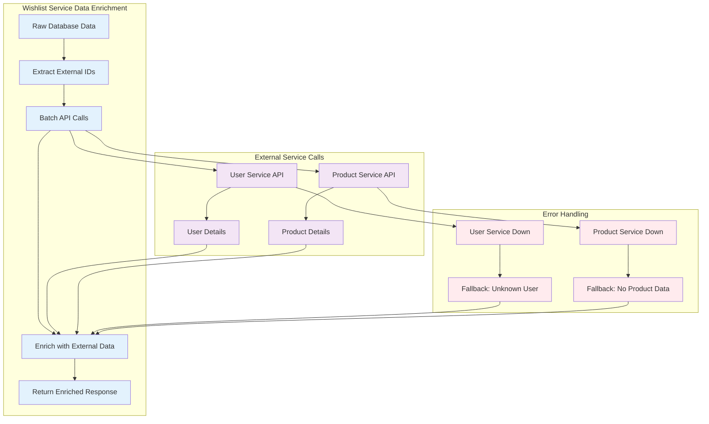

## 🚨 Error Handling Flow

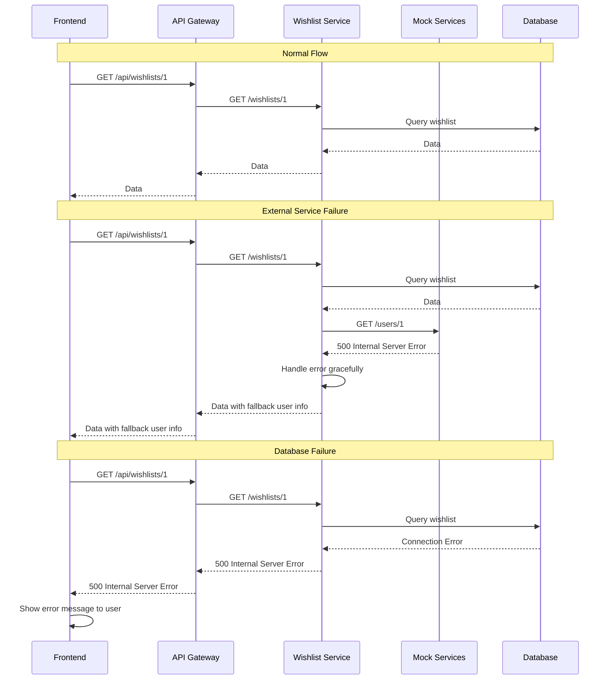

## 🔧 Service Communication Patterns

### API Gateway Pattern

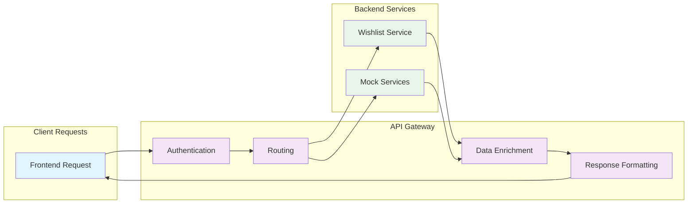

### Data Enrichment Pattern

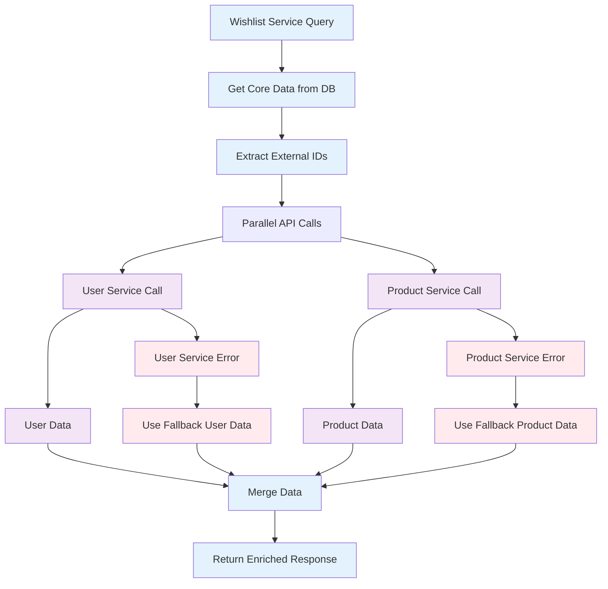

## 🎯 Key Flow Patterns

### 1. Authentication Flow
- JWT token validation at API Gateway
- User context passed via headers
- Token refresh handled by frontend

### 2. Data Enrichment Flow
- Core data from wishlist service database
- External data via HTTP API calls
- Graceful degradation on service failures

### 3. Collaboration Flow
- Invitation tokens with expiration
- Role-based access control

### 4. Error Handling Flow
- Graceful degradation for external services
- Meaningful error messages for users
- Comprehensive logging for debugging

These flow diagrams provide a complete understanding of how the Amazon Collaborative Wishlist system operates, from user interactions to data persistence and external service integration.
